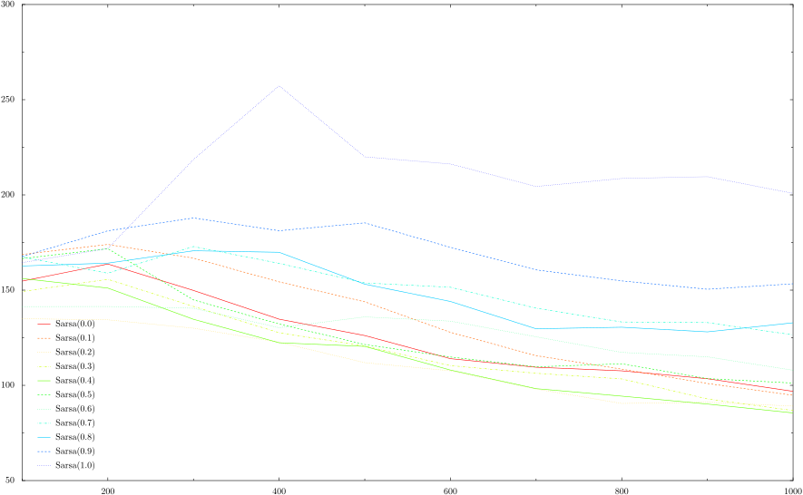

# easy21

See the assignment at https://www.davidsilver.uk/wp-content/uploads/2020/03/Easy21-Johannes.pdf

Graphs:

#### V* as per Monte Carlo

A textual representation of V* is in [`vstar.txt`](vstar.txt)

#### mean squared error for various Sarsa implementations. X=episode count

Unlike every other implementation on GitHub, this _does not use numpy or matplotlib_. Everything uses Python primitives (so you won't see `np.add`), and the only external module used is `pyx` for the charting (which I found easier to use).

## License

Licensed under the [MIT License](https://nemo.mit-license.org/). See LICENSE file for details.